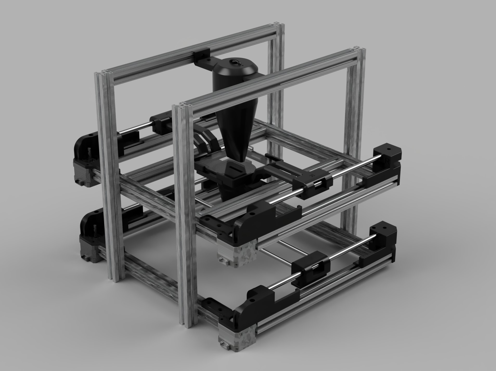
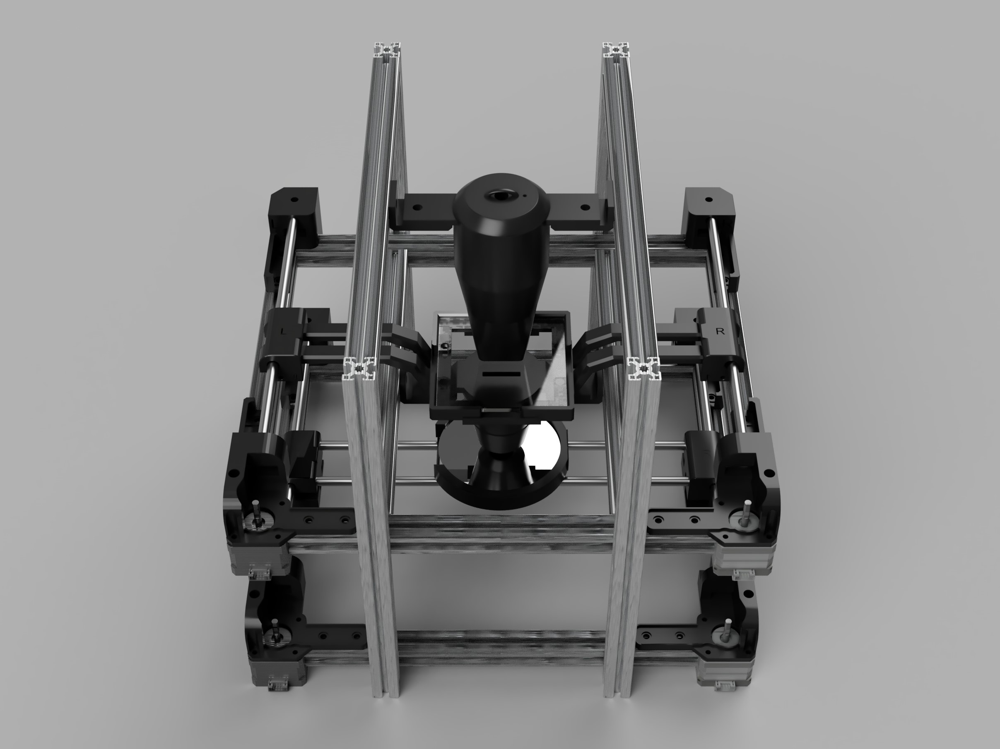

# 2024년 2학기 조원주 교수님 3학년 실험 스캐너 프로젝트



2024년 2학기 광운대학교 전자재료공학과 조원주 교수님 전자재료물성실험및설계2 수업의 **스캐너 설계를 위한 아두이노 프로젝트**입니다. 이 프로젝트는 리소그라피 장비인 스캐너의 정확한 동작을 구현하기 위해 Motor와 센서, 릴레이 등의 구성요소를 제어합니다.

## 1. Project Structure

프로젝트는 아래의 구조로 이루어진 파일으로 구성되어 있습니다:

```bash
scanner
├── README.md
├── circuit_data               
│   └── main_board.diy          - 메인보드의 PCB 회로도
├── include
│   ├── general_control.h       - 일반 설정, 제어에 관련된 클래스와 변수 선언
│   ├── motor_control.h         - Motor 설정, 제어에 관련된 클래스와 변수 선언
│   ├── parameter.h             - 시스템 매개변수와 아두이노 구성 설정
│   └── scanner.h               
├── scanner.ino                 - 메인 .ino 파일
└── src
    ├── general_control.cpp     - 일반 설정, 제어에 관련된 클래스와 변수 정의
    └── motor_control.cpp       - Motor 설정, 제어에 관련된 클래스와 변수 정의
```

## 2. Namespaces and Classes

프로젝트에서 사용되는 각 네임스페이스와 클래스에 대한 설명입니다.

### 2-1. Namespace: `Control`

제어와 관련된 모든 기능이 이 네임스페이스에 포함됩니다.

#### 2-1-1. Namespace: `Parameter`

스캐너 시스템의 매개변수를 담당하는 클래스입니다. 

- **Constants:**
  - `uint8_t INIT_X`: 초기 X 좌표
  - `uint8_t INIT_Y`: 초기 Y 좌표
  - `uint8_t MOTOR_STEPS`: 모터가 한 바퀴 회전하는 데 필요한 스텝 수
  - `uint8_t DPM`: Step per Distance; 1 mm를 움직이는 데 필요한 스텝 수
  - `uint8_t DIES`: 웨이퍼 지름에 들어갈 수 있는 Die의 수
  - `uint8_t MICROSTEP`: 모터의 마이크로테핑 설정
  - `uint16_t MOTOR_MAX_SPEED`: 모터의 최대 속도
  - `uint16_t MOTOR_SPEED`: 모터의 통상 속도
  - `int 16_t INITIAL_MOVE_DISTANCE`: 초기 위치로 이동하기 위해 필요한 "충분히 큰 스텝"
  - `double DIE_X`: Die의 X 방향 길이
  - `double DIE_Y`: Die의 Y 방향 길이
  - `double MASK_X`: 마스크(레티클)의 X 방향 길이
  - `double MASK_Y`: 마스크(레티클)의 Y 방향 길이
  - `double EXPOSURE_TIME`: 노광 시간
  - `double LINEAR_SD_RATIO`: Linear Scale Down Radio; 레티클:Die 길이 축소 비율

#### 2-1-2. Class: `MotorControl`

Motor 설정 및 제어를 담당하는 클래스입니다. 모든 메서드가 `static`으로 선언됩니다. 

- **Methods:**
  - `void SetMotor(AccelStepper &motor, uint16_t max_speed)`: Motor의 최대 속도를 설정
  - `void SetMicroStep(const uint8_t* microstep_pin_arr, uint8_t microstep)`: Motor의 마이크로스테핑을 설정

#### 2-1-3. Class: `GeneralControl`

시스템 초기화, 동작, 입력 대기 등 일반적인 시스템 제어를 담당하는 클래스입니다. 모든 상수와 메서드가 `static`으로 선언됩니다.

- **Members:**
  - `enum Direction`: Scan을 위한 모터 구동의 방향 설정
  - `enum FloorIndex`: 각 층을 구분하기 위한 인덱스
  - `enum MotorIndex`: 시스템을 구성하는 네 개의 모터를 구분하기 위한 인덱스
  - `enum AxisIndex`: 각 층의 X, Y 축을 구분하기 위한 인덱스
  - `Floor* floor[2]`: 시스템을 구성하는 두 층 객체의 주소를 담는 포인터 배열
  - `AccelStepper* motor[4]`: 시스템을 구성하는 네 모터 객체의 주소를 담는 포인터 배열
  - `uint8_t enable[4]`: 네 모터의 Enable 신호를 담당하는 핀 배열
  - `int16_t limit[3]`: 이동 가능한 세 축의 리미트 스위치 핀 배열

- **Constants:**
  - `uint32_t DBNC_DLY = 50;`: 버튼 디바운싱을 위한 지연 시간 (밀리초)
  - `uint8_t ON = 0x0;`: Active LOW에서의 ON 상태
  - `uint8_t OFF = 0x1;`: Active LOW에서의 OFF 상태

- **Methods:**
  - `void ConfigSystem(...)`: 스캐너 시스템 구성을 설정
  - `void SetPinMode()`: 아두이노의 각종 Pin 모드를 설정
  - `void InitializeSystem()`: 시스템을 초기화
    - Motor와 아두이노를 설정하고 초기 위치로 이동
  - `void WaitTillPressed(uint8_t pin)`: 특정 Pin이 눌릴 때까지 대기
  - `void WaitForStart()`: 시작 버튼이 눌릴 때까지 대기
  - `void InitializePosition()`: 웨이퍼와 광원의 상대 위치를 초기화
  - `void ControlLED(uint8_t op)`: LED를 제어; `op`에 따라 ON/OFF를 설정
  - `void ControlFan(uint8_t op)`: 팬을 제어; `op`에 따라 ON/OFF를 설정
  - `void StartExposure()`: Exposure 시작
  - `void EndExposure()`: Exposure 종료
  - `void CheckExposure()`: Exposure 종료 조건을 확인
  - `void ScanMove(bool reverse=false)`: 스캔 동작에 필요한 모터 제어
    - `reverse` 신호에 따라 반대 방향으로도 모터 제어 수행 가능
  - `void Scan()`: 스캔 동작을 수행
  - `void Operate()`: 웨이퍼 전체에 걸쳐 공정을 진행

#### 2-1-4. Class: `Floor`

각 층의 두 Motor를 층별로 한 번에 제어하기 위한 클래스입니다.

- **Members:**
  - `enum MotorIndex`: 층을 구성하는 두 Motor 객체를 구별하기 위한 인덱스
  - `enum AxisIndex`: 두 축을 구별하기 위한 인덱스
  - `AccelStepper* motor[2]`: 각 층의 두 모터 객체의 주소를 담은 포인터 배열
  - `uint8_t enable[2]`: 두 모터 객체의 Enable 신호를 담당하는 배열
  - `int16_t limit[2]`: 두 축의 리미트 스위치 핀 배열
    - 리미트 스위치가 없는 경우(2층) `-1`로 설정

- **Methods:**
  - `void SetFloor(...)`: 층의 왼쪽과 오른쪽 Motor 및 리미트 스위치를 설정
  - `void Enable()`: 층의 모든 Motor를 활성화
  - `void Disable()`: 층의 모든 Motor를 비활성화
  - `void Move(AxisIndex axis, double distance)`: 지정한 축을 따라 주어진 거리만큼 웨이퍼 스테이지 또는 레티클을 이동
  - `void MoveToInitial(AxisIndex axis)`: 지정한 축의 초기 위치로 이동

#### 2-1-5. Class: `State`

현재 웨이퍼의 위치, UV LED 제어를 위한 정보 등을 포함하는 시스템의 상태를 관리하는 클래스입니다. 모든 멤버 및 메서드가 `static`으로 선언됩니다.

- **Members:**
  - `Position current_pos`: 웨이퍼의 현재 위치
  - `uint8_t num_executions`: 실행 횟수
  - `unsigned long exposure_start_time`: 노출이 시작된 시간
  - `bool exposing`: UV LED의 ON/OFF 상태

- **Methods:**
  - `void SetX(uint16_t x_value)`: 현재 위치의 x 좌표를 설정
  - `void SetY(uint16_t y_value)`: 현재 위치의 y 좌표를 설정
  - `void IncreaseX()`: 현재 위치의 x 좌표를 1 증가
  - `void IncreaseY()`: 현재 위치의 y 좌표를 1 증가
  - `void IncreaseNumExecutions()`: 실행 횟수를 1 증가
  - `void InitState()`: 시스템 상태를 초기화
  - `void SetExposing(bool state)`: UV LED의 상태를 설정
  - `void UpdateExposureStartTime()`: 노출이 시작된 시간을 업데이트
  - `uint16_t GetX()`: 현재 위치의 x 좌표를 리턴
  - `uint16_t GetY()`: 현재 위치의 y 좌표를 리턴
  - `uint8_t GetNumExecutions()`: 실행 횟수를 리턴
  - `bool GetExposing()`: UV LED의 상태를 리턴
  - `unsigned long GetExposureStartTime()`: 노출이 시작된 시간을 리턴

---

### 2-2. Namespace: `ArduinoMega`

시스템에 사용되는 아두이노 메가의 Pin 할당 정보가 이 네임스페이스에 포함됩니다.

- **Constants:**
  - `uint8_t START`: 시작 버튼
  - `uint8_t RESTART`: 재시작 버튼
  - `uint8_t EXPOSURE_CTRL`: UV LED 제어를 위한 릴레이 제어 신호
  - `uint8_t FAN_CTRL`: 쿨링 팬 제어를 위한 릴레이 제어 신호
  - `uint8_t LIMIT_1F_X`: 1층 x축 리미트 스위치
  - `uint8_t LIMIT_1F_Y`: 1층 y축 리미트 스위치
  - `uint8_t LIMIT_2F_Y`: 2층 y축 리미트 스위치

#### 2-2-1. Namespace: `MotorPin`

Motor 제어를 위한 아두이노 메가의 Pin 할당 정보가 이 네임스페이스에 포함됩니다.

- **Constants:**
  - `uint8_t ENABLE_1F_R`: 1층 오른쪽 Motor 활성화 신호
  - `uint8_t ENABLE_1F_L`: 1층 왼쪽 Motor 활성화 신호
  - `uint8_t ENABLE_2F_R`: 2층 오른쪽 Motor 활성화 신호
  - `uint8_t ENABLE_2F_L`: 2층 왼쪽 Motor 활성화 신호
  - `uint8_t STEP_1F_R`: 1층 오른쪽 Motor Step 신호
  - `uint8_t STEP_1F_L`: 1층 왼쪽 Motor Step 신호
  - `uint8_t STEP_2F_R`: 2층 오른쪽 Motor Step 신호
  - `uint8_t STEP_2F_L`: 2층 왼쪽 Motor Step 신호
  - `uint8_t DIR_1F_R`: 1층 오른쪽 Motor Direction 신호
  - `uint8_t DIR_1F_L`: 1층 왼쪽 Motor Direction 신호
  - `uint8_t DIR_2F_R`: 2층 오른쪽 Motor Direction 신호
  - `uint8_t DIR_2F_L`: 2층 왼쪽 Motor Direction 신호
  - `uint8_t MICROSTEP_1F_R[3]`: 1층 오른쪽 Motor 마이크로스테핑 신호
  - `uint8_t MICROSTEP_1F_L[3]`: 1층 왼쪽 Motor 마이크로스테핑 신호
  - `uint8_t MICROSTEP_2F_R[3]`: 2층 오른쪽 Motor 마이크로스테핑 신호
  - `uint8_t MICROSTEP_2F_L[3]`: 2층 왼쪽 Motor 마이크로스테핑 신호

---

### 2-3. Class: `Position`

웨이퍼와 광원의 상대적인 위치를 좌표 형태로 처리하는 클래스입니다.

- **Members:**
  - `uint16_t x`: 위치의 x 좌표
  - `uint16_t y`: 위치의 y 좌표

- **Methods:**
  - `uint16_t GetX() const`: x 좌표를 리턴
  - `uint16_t GetY() const`: y 좌표를 리턴
  - `void SetX(uint16_t x_value)`: x 좌표를 설정
  - `void SetY(uint16_t y_value)`: y 좌표를 설정
  - `void IncreaseX()`: x 좌표를 1 증가
  - `void IncreaseY()`: y 좌표를 1 증가

## 3. Getting Started

1. **Upload the Code**: 아두이노와 PC를 연결한 뒤 `scanner.ino` 파일을 아두이노에 업로드
2. **Hardware Setup**: 
  - 아두이노와 Motor, 스위치, 버튼, 릴레이 등 모든 구성 요소를 연결
  - Systembox를 조립하고 정격 전압 20V의 DC 어댑터를 메인보드에 연결
  - `parameter.h` 파일의 `ArduinoMega` 네임스페이스에 연결 정보를 업데이트
3. **Start Operation**: 전원을 켜고 시작 버튼을 눌러 작동을 시작

## 4. Dependencies

- Arduino IDE
- Stepper motor drivers & library: AccelStepper
- Scanner Hardware

## 5. Team Members

광운대학교 전자재료공학과

- 2020734003 정지호
- 2020734004 조민규
- 2020734041 양승민
- 2020734047 정윤철
- 2022734025 김다인
- 2022734037 김유민

## 6. License

This project is licensed under the MIT License - see the [LICENSE](LICENSE) file for details.
